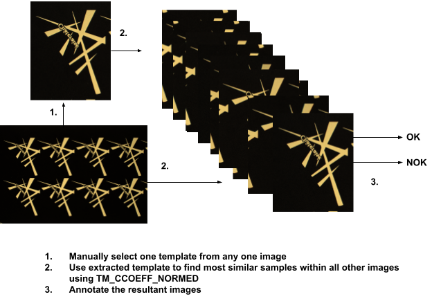
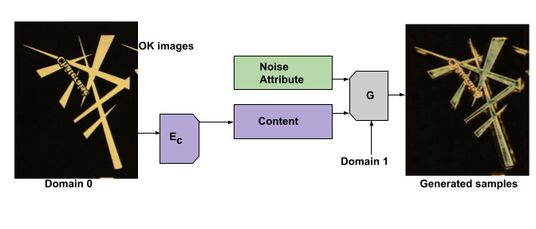
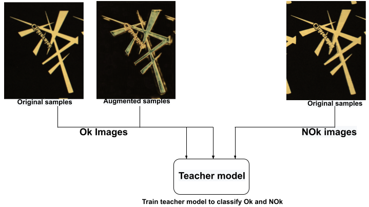
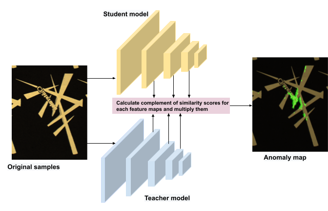
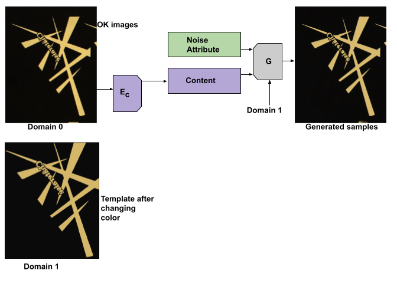
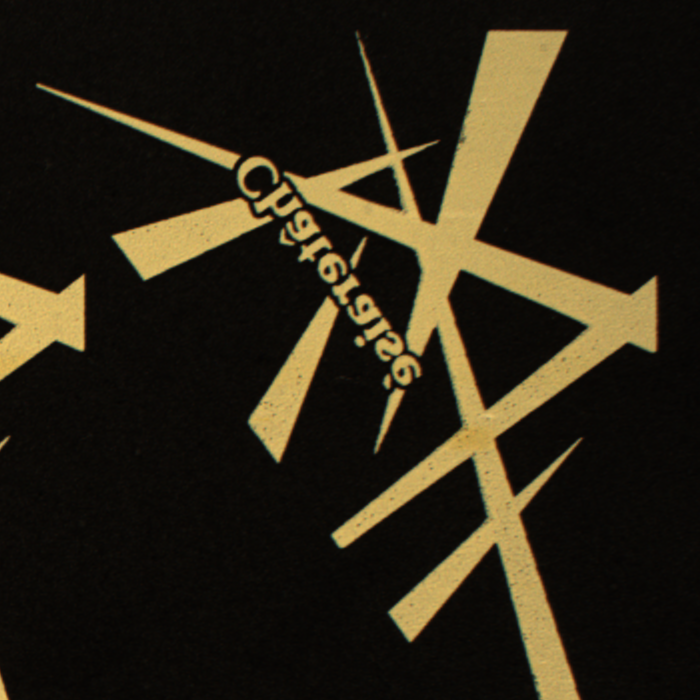
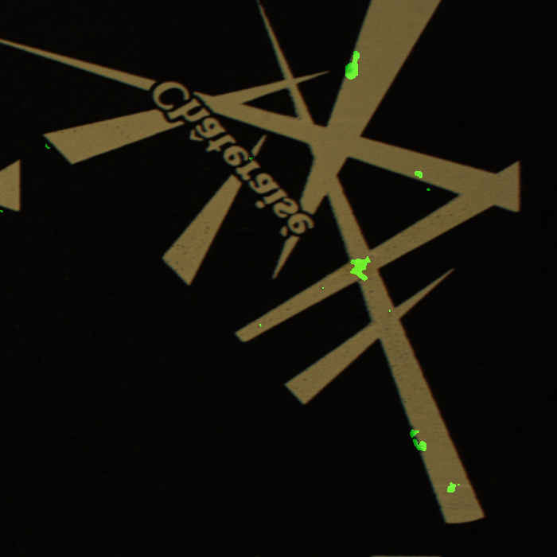

# Anomaly Detection

1. Segmentation And Annotation

2. Propose An Anomaly Detection Model
[Output Anomaly Maps](https://drive.google.com/drive/folders/1Q6xTlgtAseS8PYk3Mc4VIpS7Wt-E757J?usp=sharing)

    1. Generate new samples using OK images using HistAuGAN
[Generated Samples](https://drive.google.com/drive/folders/1VJfZKvlc-h2P9r0uLWA34kFx21atnXcA?usp=sharing)
    
    
    2. Fine-Tune teacher model on OK images
    
    
    3. Use Teacher model to teach student model by minimising the teacher student extracted features for OK images. Get anomaly map by        calculating the similarity between student and teacher extracted features for sample images.
    

3. Anomaly Detection Given a Single Good Template
[Output Anomaly Maps](https://drive.google.com/drive/folders/18FoeMpwZ98pnrnw44jxtWnmPgg3wd6rG?usp=sharing )
    
    1. Generate new samples using OK images and Good Template using HistAuGAN 
[Generated Samples](https://drive.google.com/drive/folders/1VJfZKvlc-h2P9r0uLWA34kFx21atnXcA?usp=sharing)
    
    
    2. Fine-Tune teacher model on OK images
    
    
    3. Use Teacher model to teach student model by minimising the teacher student extracted features for OK images. Get anomaly map by        calculating the similarity between student and teacher extracted features for sample images.
    

No-Template|Template
 --- | ---
 | 

[Working colab Notebook](https://github.com/TapasKumarDutta1/anomaly-detection/blob/main/Working_Demo_anomaly_detection.ipynb) available for using different files 
